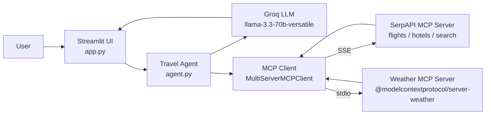

# TRAVEL-PLANNER-MCP

An AI travel planning assistant built with Streamlit, Groq LLMs, and a LangChain + Model Context Protocol (MCP) agent layer.

---

## Overview

Planning a trip is a multi-source research task. A traveller usually needs to know the cultural background of the destination, current and forecast weather, suitable travel dates, indicative flight and hotel prices, and a sensible day-by-day itinerary. Pulling all of that together by hand means jumping between weather sites, flight aggregators, hotel listings, and travel blogs.

This project compresses that workflow into a single Streamlit page. The user types a free-form prompt such as "Plan a 3-day trip to Tokyo in May" and an LLM-backed agent returns a structured plan covering history, weather, flights, hotels, and a per-day itinerary. The default chat path uses Groq's hosted Llama 3.3 70B model for fast inference.

The repository also contains an MCP-based agent module (`agent.py`) that demonstrates how the same product could be wired to live data sources through the Model Context Protocol. It connects to SerpAPI's hosted MCP endpoint (for flight, hotel, and search tools) and a local weather MCP server, then exposes the discovered tools to a LangChain ReAct agent. This is the "MCP" half of the project name and is the direction the codebase is built to grow into.

---

## Key Features

- Single-page Streamlit web UI for natural-language trip prompts (`app.py:14`).
- Groq-hosted Llama 3.3 70B Versatile inference, configured at low temperature for consistent itineraries (`app.py:22`).
- Async-aware execution using `nest_asyncio` so the Streamlit event loop can drive async agent code (`app.py:8`).
- Structured prompt template that always returns six sections: cultural notes, weather, best dates, flights, hotels, and day-wise itinerary (`app.py:27`).
- Optional MCP agent module (`agent.py`) wiring SerpAPI MCP and a local weather MCP server through `langchain-mcp-adapters`.
- All API keys read from environment variables via `python-dotenv` — no secrets are committed.
- `.gitignore` already excludes `.env`, `venv/`, and `__pycache__/`.

---

## Agent Architecture

The project shows two layers that together explain the "MCP" in the name.

**Layer 1 — Direct LLM call (active in `app.py`):**
The Streamlit UI builds a prompt from the user's request and calls `ChatGroq.invoke()` directly. There is no tool-calling loop here — the model produces the entire plan from its own knowledge in a single turn. This is the path that runs when you launch the app today.

**Layer 2 — MCP-driven tool agent (defined in `agent.py`, ready to be wired in):**
`agent.py` uses `langchain_mcp_adapters.MultiServerMCPClient` to connect to two MCP servers:

- `serpapi` over Server-Sent Events (SSE), pointing at `https://mcp.serpapi.com/<KEY>/mcp` for search, flights, and hotels.
- `weather` over stdio, launched as `npx -y @modelcontextprotocol/server-weather`.

`client.get_tools()` discovers every tool the servers expose and returns them as LangChain `Tool` objects, ready to be passed to a ReAct agent (`create_react_agent` is already imported from `langchain_classic.agents`).

### What is MCP?

The Model Context Protocol is an open standard from Anthropic that lets LLM applications talk to external tools and data sources through a uniform JSON-RPC interface. Instead of writing a bespoke wrapper for every API, an application connects to an MCP server and the server advertises its tools. The client (here, LangChain) can then call those tools without knowing their internals. SerpAPI ships an official MCP endpoint, and the MCP project maintains reference servers for things like weather, file systems, and Git.

---

## Architecture



ASCII fallback:

```
   +--------+        +----------------+        +----------------------+
   |  User  | -----> |  Streamlit UI  | -----> |   Travel Agent       |
   +--------+        |   (app.py)     |        |   (agent.py)         |
                     +----------------+        +----------+-----------+
                                                          |
                              +---------------------------+----------------------------+
                              |                           |                            |
                              v                           v                            v
                       +-------------+         +---------------------+        +------------------+
                       |  Groq LLM   |         |  SerpAPI MCP (SSE)  |        |  Weather MCP     |
                       | llama-3.3   |         | flights/hotels/srch |        |  (stdio, npx)    |
                       +-------------+         +---------------------+        +------------------+
```

---

## Tech Stack

| Layer            | Technology                                              | Purpose                                                                 |
|------------------|---------------------------------------------------------|-------------------------------------------------------------------------|
| Frontend / UI    | Streamlit 1.32.2                                        | Single-page web interface for prompt input and plan rendering           |
| LLM              | Groq + Llama 3.3 70B Versatile                          | Generates the travel plan; chosen for low-latency hosted inference      |
| Agent framework  | LangChain 0.3.27 (`langchain_classic.agents`)           | ReAct-style agent and tool orchestration in `agent.py`                  |
| Tool protocol    | Model Context Protocol via `langchain-mcp-adapters`     | Uniform interface to external tool servers                              |
| Search tools     | SerpAPI MCP endpoint (SSE)                              | Flights, hotels, and general web search                                 |
| Weather tools    | `@modelcontextprotocol/server-weather` (stdio via npx)  | Current and forecast weather data                                       |
| Async glue       | `asyncio` + `nest_asyncio`                              | Lets the synchronous Streamlit script await async MCP/agent calls       |
| Config           | `python-dotenv`                                         | Loads API keys from a local `.env` file                                 |
| Language         | Python 3.10+                                            | Runtime                                                                 |

A `langchain-google-genai` import also appears in `agent.py:7`, leaving room to swap or fall back to Gemini as the planning LLM.

---

## Tools / Capabilities

The MCP client in `agent.py:13` discovers tools dynamically at runtime, so the exact list depends on what each server exposes. Based on the configured servers:

| Tool family       | Source server                                              | Defined at        | Example operations                                  |
|-------------------|------------------------------------------------------------|-------------------|-----------------------------------------------------|
| Flight search     | SerpAPI MCP (`serpapi`)                                    | `agent.py:18`     | Look up flights between two airports on given dates |
| Hotel search      | SerpAPI MCP (`serpapi`)                                    | `agent.py:18`     | Find hotels in a city with price/rating filters     |
| Web / Places search | SerpAPI MCP (`serpapi`)                                  | `agent.py:18`     | Discover attractions, restaurants, local tips       |
| Weather lookup    | `@modelcontextprotocol/server-weather`                     | `agent.py:24`     | Current conditions and short-range forecasts        |
| Tool discovery    | `MultiServerMCPClient.get_tools()`                         | `agent.py:31`     | Returns all tools above as LangChain `Tool` objects |

In addition, the active Streamlit path (`app.py:18`) implements one in-app capability:

- `run_travel_agent(user_query)` — builds a structured travel-planning prompt and calls the Groq LLM to return the full plan in a single response.

---

## Project Structure

```
TRAVEL-PLANNER-MCP/
├── .gitignore           # Excludes .env, venv/, __pycache__/
├── README.md            # This file
├── agent.py             # MCP client + LangChain agent setup
├── app.py               # Streamlit UI and Groq-backed planner
└── requirements.txt     # Python dependencies
```

---

## Prerequisites

- Python 3.10 or newer
- `pip` and a virtual environment tool (`venv` is fine)
- Node.js / `npx` available on `PATH` (only required if you use the weather MCP server in `agent.py`)
- API keys:
  - **GROQ_API_KEY** — required for the active Streamlit chat path. Get one at https://console.groq.com/.
  - **SERPAPI_API_KEY** — required for the MCP agent path (`agent.py`). Sign up at https://serpapi.com/.
  - **OPENWEATHERMAP_API_KEY** — read by `agent.py:11`; useful if you replace the npm weather server with a direct OpenWeatherMap tool.

---

## Installation

Clone the repository and create an isolated environment:

```bash
git clone https://github.com/AYON-ARYAN/TRAVEL-PLANNER-MCP.git
cd TRAVEL-PLANNER-MCP

python -m venv venv
source venv/bin/activate            # Windows: venv\Scripts\activate

pip install -r requirements.txt
```

Create a `.env` file in the project root:

```bash
GROQ_API_KEY=your_groq_key_here
SERPAPI_API_KEY=your_serpapi_key_here
OPENWEATHERMAP_API_KEY=your_openweathermap_key_here
```

The `.env` file is already listed in `.gitignore`, so it will not be committed.

---

## Usage

Start the Streamlit app from the project root:

```bash
streamlit run app.py
```

Streamlit will open a browser tab (default `http://localhost:8501`). The page shows:

- A title — "AI Travel Planner Agent"
- A text input pre-filled with `Plan a 3-day trip to Tokyo in May`
- A **Generate Travel Plan** button

Type any free-form travel request, click the button, and the agent returns a markdown plan containing cultural notes, weather, best dates, flights, hotels, and a day-wise itinerary.

### Example prompts

```
Plan a 5-day trip to Kyoto in late October for two people on a mid-range budget.

I have one week off in December. Suggest a beach destination in Southeast Asia
with flights from Delhi and a daily itinerary.

Plan a 4-day cultural trip to Rome focused on art museums and walking tours.
```

### Streamlit Cloud deployment

If deploying to Streamlit Community Cloud, paste your keys into the app's **Secrets** panel using the same names (`GROQ_API_KEY`, etc.). The app reads them through `os.getenv`, which works for both local `.env` files and Streamlit secrets.

---

## Configuration

| Environment variable      | Required for          | Used at         | Description                                                            |
|---------------------------|-----------------------|-----------------|------------------------------------------------------------------------|
| `GROQ_API_KEY`            | Streamlit chat path   | `app.py:13`     | Authenticates calls to Groq for Llama 3.3 70B inference                |
| `SERPAPI_API_KEY`         | MCP agent path        | `agent.py:10`   | Used to build the SerpAPI MCP URL for flights, hotels, and search      |
| `OPENWEATHERMAP_API_KEY`  | Optional weather tool | `agent.py:11`   | Reserved for a direct OpenWeatherMap integration                       |

The Groq model name (`llama-3.3-70b-versatile`) and temperature (`0.3`) are set inline at `app.py:22`–`app.py:25`. Change them there to swap models or make outputs more creative.

---

## Limitations & Future Work

- **The active app does not call live tools.** `app.py` uses the LLM's own knowledge to draft plans. Flight, hotel, and weather numbers are therefore approximate and may not reflect current pricing or conditions.
- **`agent.py` is not yet wired into the UI.** The MCP agent is defined but `app.py` does not import `get_tools()` or build a ReAct executor. The next step is to call `get_tools()`, pass the result to `create_react_agent`, and replace the direct `llm.invoke(prompt)` in `app.py:50` with `AgentExecutor.invoke`.
- **No persistent state.** Each click is independent — there is no chat history, saved itinerary, or user account.
- **No input validation.** Free-form prompts are passed straight to the LLM. Empty or adversarial inputs are not filtered.
- **Single LLM provider.** Although `langchain-google-genai` is imported, only Groq is actively used.
- **Possible feature additions:** booking links, currency conversion, visa/safety advisories, PDF export of itineraries, multi-turn chat memory, and authenticated user accounts.

---

## License

Released under the MIT License. You are free to use, modify, and distribute the code with attribution. Add a `LICENSE` file at the repository root with the standard MIT text if you intend to publish it.
